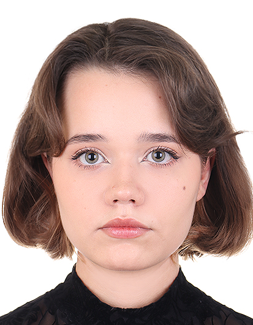

<html>
  <head>
    <title> Резюме Арзамасцевой Татьяны </title>
      
  </head>
  <body onload="calculateAge()"   bgcolor="#90EE90" >
    
    <h2> <i> <b>Арзамасцева Татьяна </b></i> </h2>
    
 <b> Дата рождения:</b> 08.10.2004 (20 лет)

    
 <b> Телефон: </b> +7 (951) 480-24-53 

    
 <b> Адрес: </b> Россия, г. Челябинск, ул. Кирова д. 23А кв. 36 

    
 <b> Опыт работы: </b> Отсутствует 

    
 <b> О себе: </b> Учусь на специальности "Прикладная математика и информатика" на втором курсе ЮУрГУ. 

    <h2> <i> <b> Знание языков: </b></i> </h2>
    <table>
      <tr><td></td><td>HTML</td><td>JavaScript</td><td>С#</td><td>C++</td><td>Python</td></tr>
      <tr><td>Отличное владение</td><td></td><td></td><td></td><td></td><td></td></tr>
      <tr><td>Хорошее владение</td><td></td><td></td><td></td><td></td><td></td></tr>
      <tr><td>Среднее владение</td><td>+</td><td></td><td>+</td><td>+</td><td>+</td></tr>
      <tr><td>Плохое владение</td><td></td><td>+</td><td></td><td></td><td></td></tr>
    </table>

    

      

        <label> Почта: </label>
        <input placeholder="zedrokarz@yandex.ru">
        

      

        <label> Телеграм: </label>
        <input placeholder="@cedrrrrr">
      

    

  
    <h3 align = "center" class="clickable" id="toggleButton"> Узнать меня подробнее </h3>
    

      <blockquote> Здравствуйте! Меня зовут Татьяна Арзамасцева, мне 20 лет. Я студентка МФТИ-группы 2 курса "Прикладной математики и информатики". Мне нравится получать знания и знакомиться с различными интересными людьми. В свободное от учёбы время люблю проводить время с близкими людьми, смотреть фильмы, читать книги и заниматься творчеством. Раньше я очень хотела пойти на направление, связанное с искусством и литературой, но, к сожалению или счастью, не сложилось. Сейчас я нахожусь в поиске самого лучшего айти-направления для себя.</blockquote>
    

      
  </body>  
</html>
